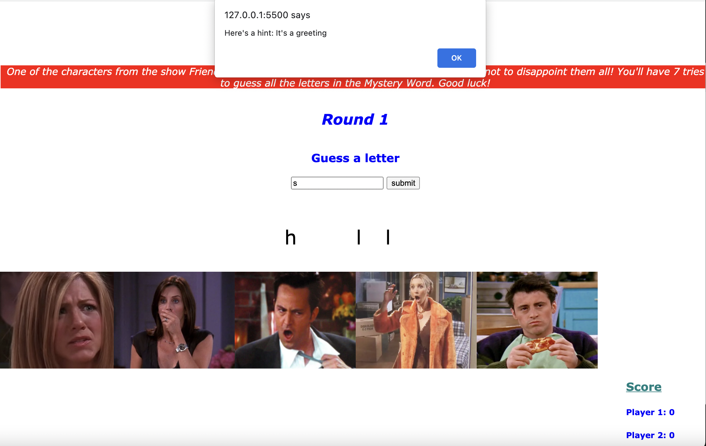

MYSTERY WORD

Link to game: https://veenaprakash123.github.io/MysteryWord/index.html

Game Description:

Mystery Word is a two-player game in which each player tries to guess a word selected by the other user. For each round, one player will select a word, and the other player will guess the letters that are included in that word. 

For every incorrect guess, an image of one of the characters from the popular television series Friends will display- however the character will look very disappointed in you for guessing incorrectly! 

Once a player correctly guesses all the letters in the ‘mystery’ word, they win the round! For the following round, the players will switch places - the one who guessed in the prior round will now select the word for the next round, and vice versa. The first player to win two rounds wins the overall game!

Technologies Used: 

1. HTML
2. CSS
3. Javascript

Installation Instructions: 

1. Installation not required- Just use the link above to play the game!

User Stories for MVP: 

1.	As a player, I want the game to allow me or my opponent to enter a word so that the other player can guess letters in that word.
2.	As a player, I want the word selected by my opponent to initially be hidden from view so that I won’t see the letters that I am supposed to guess.
3.	As a player, I want to see the letter(s) that I guess correctly, so that I can see my progress and potentially guess the whole word.
4.	As a player I want the game to display an image every time I guess a letter that does not belong to the hidden word, so that I the number of times I guess incorrectly is visually tracked.
5.	As a player, I want to be notified if I have guessed all the letters in the mystery word correctly, so that I know if I have won the round. 
6.	As a player, I want to be notified if I have run out of opportunities to guess letters, so that I know if I have lost the round. 
7.	As a player I want to see the score be updated every time a round is completed.
8.	As a player I want to be notified who ultimately wins the game – whether me or my opponent is the first player to win two rounds.  

Screenshots of the game: 

User Stories for Stretch goals: 

1.	As a Player I want the opportunity to guess the whole word at once, so that I can win the round faster if I have figured out what the word is. (Not implemented yet)
2.	As a Player I want to enter a hint for the mystery word I select, so that my opponent can get help if they are struggling. (Implemented)
3.	As a Player I want to receive a hint after guessing a certain number of incorrect letters, so that I can be led towards making better guesses. (Implemented)

Unsolved Problems: 

Currently the game does not properly reset by itself once a player wins 2 rounds. For this reason, the player is asked to select 'OK' in the alert messages/prompts they see after the game ends, and then need to refresh the page in order to restart.

Hurdle that was overcome: 

One issue that I faced early on was the way in which the Mystery Word would be hidden on the page. I created divs for each letter and then adjusted the display of the div to none. This caused issues because when a div's display is 'none', the page ignores the div as a whole and other elements on the page are rearranged. To work around this, I matched the color of the Mystery Word to the color of the background (which is white), and changed the color of each letter to black when guessed correctly by the player. 
